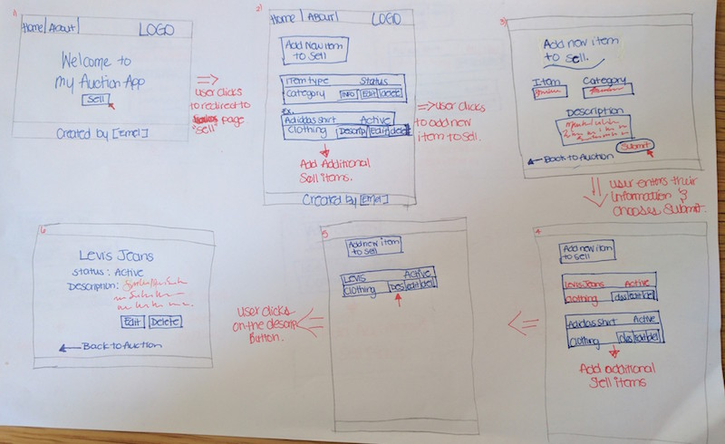
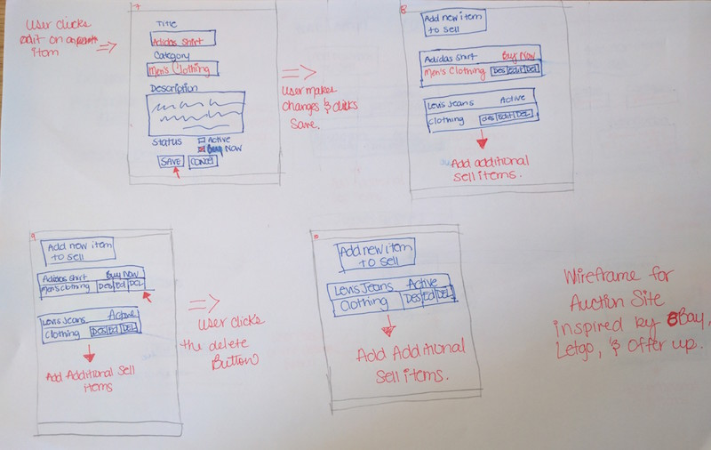

# Auction APP

### Why an Auction APP?
#####  Many of us have unwanted things laying around our home and either throw them out or just use them as old rags. Instead, we are offering our users the chance to make some extra cash, quick and easy.By simply selling your old and unwanted items here on The Auction APP.

# Wireframe

 Item Type.

 | id |   item   | description | status | 
 |----|:--------:|:-----------:|-------:|
 |  1 | jeans    | blue, slim  | active |
 |  2 | PS 4 Pro | console     | active |
 |  3 | legos    | star war set| buy    |
 |  4 | honda civ| old junk    | active |

  Category.                       
 
 | cate. id |   category   |
 |---------:|-------------:|
 |   1      |  fashion     |
 |   2      |  electronics |
 |   3      |  toys        |
 |   4      |  auto        |     

 # Building Auction App
 ##### I am building this app for people who enjoy cleaning out their closet to get rid of unwanted things from their home to make some of their money back. After moving out, I realized that I had way too many things that I wasn't using. One day, I decided to gather it all up and starting posting on eBay.com and soon after, this became more of a hobbie than "getting rid" of things.

 # Advanced Feature (Post MVP)
1. Add Photos.
2. User Authentication.
3. Third Party API (findProduct API-eBay).
4. Time left feature.

